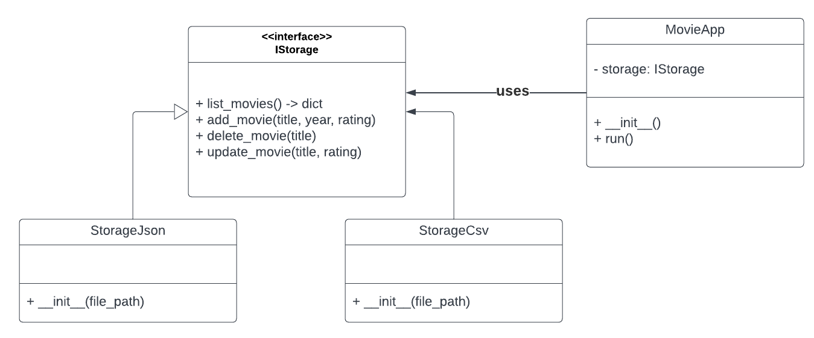

# My Movie App

A command-line tool to manage a personal movie library, with OMDb API integration and a static HTML site generator. You can choose between JSON or CSV storage backends, fetch movie metadata automatically, and produce a simple browsable webpage.

---

## Project Structure

```
.
├── _static
│   ├── index.html            # Generated static site
│   ├── index_template.html   # HTML template
│   └── style.css             # CSS for the generated site
├── config
│   └── .env                  # Environment variables (Omdb API key)
├── data
│   ├── movies.csv            # Example CSV storage (optional)
│   └── movies.json           # Example JSON storage (optional)
├── info
│   └── scheme.png            # UML overview of core classes
├── storage
│   ├── istorage.py           # IStorage interface definition
│   ├── storage_csv.py        # CSV-backed IStorage implementation
│   └── storage_json.py       # JSON-backed IStorage implementation
├── tests
│   ├── test_movie_app.py     # Pytest tests for MovieApp behavior
│   └── test_storage_json.py  # Pytest tests for StorageJson
├── main.py                   # Entry point (argument parsing + CLI launcher)
├── movie_app.py              # MovieApp class (menu + command dispatch)
├── omdb_client.py            # Wrapper for OMDb API calls
├── website_generator.py      # Generates static HTML from a template
├── requirements.txt          # Python dependencies
└── README.md                 # This file
```

---

## How It Works (High-Level)

Below is a rudimentary UML diagram illustrating how the core classes and interfaces interact. (You can also view it in `info/scheme.png`.)



1. **IStorage (interface)**

   * Defines four basic CRUD methods that any storage backend must provide:

     * `list_movies() → dict`
     * `add_movie(title, year, rating, poster) → None`
     * `delete_movie(title) → None`
     * `update_movie(title, rating) → None`
   * Does not contain any implementation—only method signatures.

2. **StorageJson (implements IStorage)**

   * Stores all movie data in a single JSON file on disk.
   * Implements the four interface methods by reading/writing JSON.

3. **StorageCsv (implements IStorage)**

   * Stores all movie data in a CSV file on disk.
   * Implements the same four methods (list, add, delete, update) by reading/writing CSV rows.

4. **MovieApp**

   * Holds a reference to an `IStorage` instance (either `StorageJson` or `StorageCsv`).
   * Presents a simple text-based menu to the user (list, add, delete, update rating, stats, random pick, search, sort, generate website).
   * When “Add movie” is chosen, it invokes the `omdb_client` to fetch the title’s metadata (year, IMDb rating, poster URL) from OMDb, then stores that record via `IStorage.add_movie(...)`.
   * “Generate website” builds a static HTML file under `_static/index.html` by injecting stored movies into a template (`index_template.html`).

5. **omdb\_client**

   * Reads an environment variable `OMDB_API_KEY` (from `config/.env`).
   * Provides `get_movie_data(title) → dict`, which queries the OMDb REST API, raises a `MovieNotFoundError` or `OmdbAPIError` if something goes wrong, and otherwise returns a JSON-decoded dict containing fields like `Title`, `Year`, `imdbRating`, and `Poster`.

6. **website\_generator**

   * Given any `IStorage` instance and the path to `_static/index_template.html`, it builds a grid of `<li>` elements (poster + details) for each stored movie.
   * Replaces two placeholders in the template—`__TEMPLATE_TITLE__` and `__TEMPLATE_MOVIE_GRID__`—and writes the final HTML to `_static/index.html`.

---

## Installation

1. **Clone** or download this repository to your local machine.

2. **Create and activate** a Python virtual environment (recommended):

   ```bash
   python3 -m venv venv
   source venv/bin/activate    # macOS/Linux
   venv\Scripts\activate       # Windows
   ```

3. **Install** dependencies:

   ```bash
   pip install -r requirements.txt
   ```

   * `colorama` – colored console output
   * `requests` – HTTP client for OMDb calls
   * `python-dotenv` – load `.env` variables
   * `pytest` – run unit tests

---

## Configuration

1. Copy or create `config/.env` and add your OMDb API key:

   ```ini
   OMDB_API_KEY=your_actual_api_key_here
   ```
2. The application will load this key at runtime to query OMDb.

---

## Usage

### Running the CLI

```bash
# JSON storage (default, file: data/movies.json)
python main.py

# JSON storage with a custom path
python main.py --storage json --file data/my_movies.json

# CSV storage with a custom path
python main.py --storage csv --file data/my_movies.csv
```

If you omit `--file`, it defaults to `data/movies.json` or `data/movies.csv`. The `data/` folder will be created automatically if it doesn’t exist.

#### Menu Commands

```
0. Exit
1. List movies
2. Add movie
3. Delete movie
4. Update movie rating
5. Stats
6. Random movie
7. Search movie
8. Movies sorted by rating
9. Generate website
```

* **List movies**
  Prints each stored movie’s title, year, and rating.

* **Add movie**
  Prompts for a movie title (e.g., “Inception”). The app calls OMDb, retrieves metadata (Title, Year, IMDb rating, Poster URL), and saves it. Any errors (not found, network/invalid API key) are caught and displayed.

* **Delete movie**
  Prompts for a title, removes the record from storage if found.

* **Update movie rating**
  Prompts for a title and a new rating (1–10). Only updates the rating field.

* **Stats**
  Calculates and displays:

  * Average rating
  * Median rating
  * Best movie(s) (highest rating)
  * Worst movie(s) (lowest rating)

* **Random movie**
  Chooses a random stored movie and prints its details.

* **Search movie**
  Prompts for a substring, lists all matching titles (case-insensitive).

* **Movies sorted by rating**
  Prints all entries in descending order of rating.

* **Generate website**
  Reads all movies from storage, fills the template (`_static/index_template.html`), and writes `_static/index.html`. Open that file in your browser to see a styled grid of posters and details.

---

## Testing

Run unit tests with:

```bash
pytest
```

* **`tests/test_storage_json.py`** – CRUD tests for the JSON backend.
* **`tests/test_movie_app.py`** – Behavior tests for `MovieApp` (menu commands, OMDb integration, website generator).

---

## Tips & Extensions

* **Multiple Storage Profiles**
  Maintain separate JSON/CSV files for different users or purposes:

  ```bash
  python main.py --storage json --file data/john_movies.json
  python main.py --storage csv  --file data/sara_movies.csv
  ```

* **Error Handling**

  * If OMDb returns “Movie not found!”, you’ll see:

    ```
    Error: Movie 'SomeTitle' not found in OMDb.
    ```
  * If the API key is missing or invalid, or if there’s a network issue, you’ll see a red error message:

    ```
    Error: OMDb API error: <detailed message>
    ```

* **Future Enhancements**

  * Add a new storage backend by implementing `IStorage` (e.g., SQLite, MongoDB).
  * Offer a “Fetch by IMDb ID” option in `MovieApp`.
  * Improve the static HTML/CSS to be responsive.
  * Write additional tests for `StorageCsv` and `website_generator`.

---

*Thank you for using **My Movie App**! Enjoy managing your collection, fetching real-time metadata, and showcasing your favorite films with a static website.* 🎬🚀
